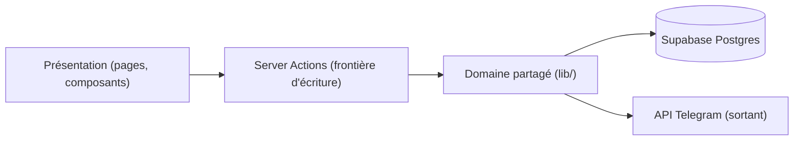
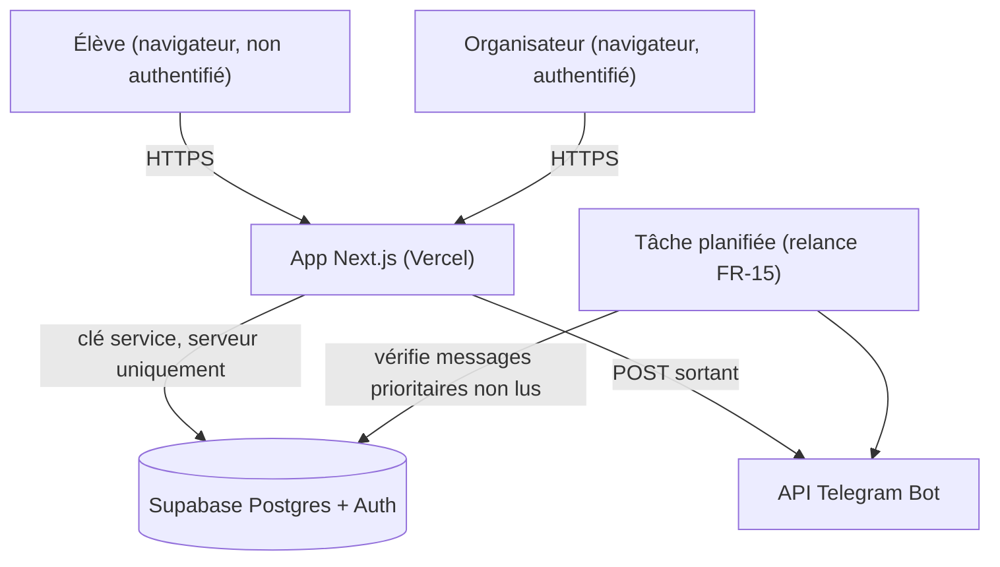
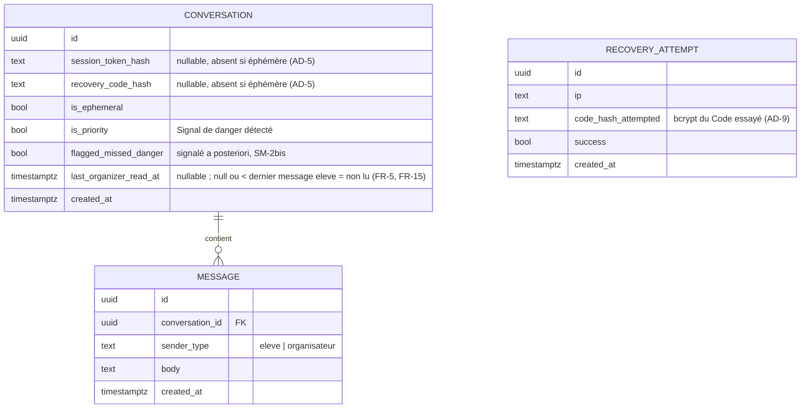

# Architecture Spine — La Parole Avant Tout

## Design Paradigm

**Monolithe en couches piloté par Server Actions**, sur Next.js App Router. Un seul projet de code, un seul déploiement, quatre couches :

| Couche | Rôle | Dossier |
| --- | --- | --- |
| Présentation | Pages, composants Server/Client | `app/**/page.tsx`, `app/**/*.tsx` |
| Frontière d'écriture | Seule porte d'entrée pour toute mutation | `app/**/actions.ts` (Server Actions) |
| Domaine partagé | Logique métier réutilisable (détection danger, session, anti-brute-force, Telegram) | `lib/` |
| Données | Accès Postgres, toujours côté serveur | `lib/supabase-server.ts` |

Aucune couche n'est sautée : une page n'appelle jamais directement `lib/supabase-server.ts`, elle passe par une Server Action.

## Invariants & Rules



### AD-1 — Un seul site, hors Wix

- **Binds:** all (FR-1..FR-19)
- **Prevents:** un pont fragile entre l'ancien site Wix et le nouveau code (iframe, lien bancal), ou une logique dupliquée entre les deux.
- **Rule:** le site Wix existant est entièrement remplacé. Vitrine (FR-12, FR-13), chat (FR-1..FR-19) et interface organisateurs (FR-4..FR-6) vivent dans un seul projet Next.js, un seul déploiement Vercel. `[ADOPTED]` — choix explicite de Charles.

### AD-2 — Stack cœur verrouillée

- **Binds:** all
- **Prevents:** un des deux développeurs introduit un autre framework, backend ou hébergeur "parce que c'est plus simple" localement, créant deux systèmes à maintenir.
- **Rule:** Next.js (App Router, TypeScript) + Supabase (Postgres + Auth) + Vercel (hébergement), et rien d'autre côté serveur/hébergement sans repasser par ce spine. `[ADOPTED]`

### AD-3 — Server Actions comme unique frontière d'écriture

- **Binds:** FR-1, FR-3, FR-6, FR-9, FR-16, FR-17, FR-18, FR-19
- **Prevents:** un dev crée des routes API REST pendant que l'autre utilise des Server Actions — deux patrons incompatibles à apprendre et déboguer.
- **Rule:** toute écriture (envoi de message, choix de mode, création/vérification de Code, réponse organisateur) passe par une Server Action colocalisée avec la page qui l'utilise. Aucune route API custom, à une exception : l'appel serveur **sortant** vers l'API Telegram (ce n'est pas un endpoint exposé, rien n'y entre depuis l'extérieur). Une Server Action reste directement appelable (ce n'est pas juste "du code de page") : chaque Server Action vérifie donc **elle-même**, dans son propre corps, l'autorisation nécessaire (session organisateur valide, ou jeton de conversation correspondant) — jamais une vérification supposée déjà faite par la page qui l'affiche. Ça évite qu'une action jugée "à faible enjeu" (ex. `marquerLu`) soit écrite plus vite, sans le contrôle que son voisin `repondre` a bien.

### AD-4 — Tout accès aux données de Conversation passe par le serveur

- **Binds:** FR-1, FR-2, FR-5, FR-6, FR-18
- **Prevents:** un client Supabase exposé au navigateur avec des règles de sécurité (RLS) complexes à écrire et à auditer soi-même ; une clé qui fuiterait côté client donnerait un accès direct aux Conversations.
- **Rule:** le navigateur ne parle jamais directement à Supabase pour les tables `conversations`/`messages`/`recovery_attempts`. Toutes les Server Actions utilisent la clé service Supabase (`SUPABASE_SERVICE_ROLE_KEY`, variable d'environnement serveur uniquement, jamais commitée). L'autorisation (est-ce bien la conversation de ce cookie ? cet organisateur est-il connecté ?) est vérifiée en code dans la Server Action (AD-3), pas via des policies RLS Postgres détaillées — plus simple à lire et à déboguer pour une équipe débutante. Filet de sécurité en plus, pas une réécriture de cette logique : la Row Level Security est **activée** sur ces trois tables, sans aucune policy autorisant les rôles `anon`/`authenticated` (deny-by-default) — seule la clé service (qui contourne RLS par nature) y accède. Ainsi, même si une clé publique Supabase finissait un jour exposée par erreur côté client, elle ne donnerait accès à rien sur ces tables.

### AD-5 — Session anonyme + Code de récupération = un seul mécanisme

- **Binds:** FR-2, FR-16, FR-17, FR-18, FR-19
- **Prevents:** mélanger la fonctionnalité "Anonymous Sign-in" de Supabase (pensée pour un seul appareil) avec un système de code maison pour le multi-appareil — deux modèles de session à comprendre et à garder synchronisés.
- **Rule:** chaque `Conversation` porte un `session_token` aléatoire, pas prévisible, posé dans un cookie `httpOnly` longue durée (~12 mois, cf. hypothèse PRD §9). C'est ce jeton, jamais une identité, qui permet le retour automatique (FR-2). Le Code de récupération (FR-17), quand il existe, est haché (jamais stocké en clair) et ne sert qu'à une chose : une fois vérifié, réémettre ce même `session_token` en cookie sur le nouvel appareil (FR-18). Mode éphémère (FR-19) : ni cookie, ni code, ni `session_token` persistant — la Conversation existe en base pour les organisateurs mais l'élève n'a aucun moyen d'y revenir (`session_token_hash` et `recovery_code_hash` restent tous deux `null` sur cette ligne). Hachage (Code comme jeton) : `bcrypt` via `bcryptjs` — implémentation pure JavaScript, sans dépendance native à compiler, donc plus simple à déployer sur Vercel que `argon2`/`scrypt`.

### AD-6 — Détection de Signal de danger par mots-clés en fichier de config

- **Binds:** FR-9, FR-10
- **Prevents:** une liste de mots-clés dupliquée entre le code et une base de données qui divergent, ou l'ajout accidentel d'un modèle d'IA de compréhension du langage (Non-Goal explicite du PRD §5).
- **Rule:** la détection est un test de correspondance simple contre une liste versionnée dans `lib/danger-keywords.ts`, exécuté côté serveur dans la Server Action d'envoi de message, avant tout accusé de réception (FR-3) et avant l'écriture en base. Modifier la liste = éditer ce fichier + déployer (push GitHub → Vercel redéploie automatiquement). Pas d'interface d'administration séparée tant que Charles et Basile restent les seuls organisateurs ET développeurs (voir Deferred). `[DÉCISION 2026-07-10]` Sur correspondance, aucune information n'est jamais renvoyée à l'Élève au-delà de l'accusé de réception standard (FR-3, identique à un message sans Signal de danger) — l'alerte (FR-10) part uniquement vers les Organisateurs (AD-7). Le rendu de `app/discussion-anonyme/page.tsx` ne doit jamais dépendre du résultat de cette détection ; FR-8 (bandeau permanent visible par l'Élève) est retiré du produit.

### AD-7 — Notification via un seul bot Telegram

- **Binds:** FR-7, FR-10, FR-15
- **Rule:** un seul bot Telegram, un `chat_id` par organisateur (2 destinataires configurés). La Server Action d'envoi de message fait un appel HTTP sortant vers l'API Telegram après écriture en base. Sur Signal de danger (FR-10), l'appel part vers les deux `chat_id` simultanément. La relance FR-15 renvoie le même message aux deux si aucun organisateur n'a ouvert la Conversation sous 4h (tâche planifiée, voir Structural Seed).
- **Prevents:** un canal de notification "normal" différent d'un canal "urgence" — complexité et code dupliqués pour un bénéfice nul à cette échelle.

### AD-8 — Accès organisateurs fermé à deux comptes

- **Binds:** FR-4, FR-5, FR-6
- **Prevents:** une page d'inscription publique ou un rôle générique "admin" qui laisserait un tiers créer un accès.
- **Rule:** authentification via Supabase Auth, email + mot de passe. Exactement deux comptes, provisionnés manuellement dans le dashboard Supabase — aucun flux d'inscription en libre-service dans le produit.

### AD-9 — Anti-brute-force sur le Code de récupération

- **Binds:** FR-18
- **Prevents:** un tiers qui devine un Code par essais successifs (le Code est choisi par l'élève, donc plus prévisible qu'un identifiant aléatoire — cf. PRD §10).
- **Rule:** chaque tentative de saisie de Code est comptée dans une table `recovery_attempts` (IP, hachage du Code essayé `bcrypt`, horodatage, succès/échec) — **pas** liée à une `Conversation` (au moment de l'essai, on ne sait pas encore si le Code correspond à une Conversation existante). Après 5 échecs consécutifs pour une même IP sur une fenêtre de 15 minutes, la vérification de Code est bloquée pour cette IP pendant 15 minutes. Mécanisme interne, pas de service tiers.

### AD-10 — Un seul environnement de production + previews Vercel

- **Binds:** all (envelope opérationnelle)
- **Rule:** un projet Supabase (production), un projet Vercel branché sur le dépôt GitHub. Chaque push sur `main` redéploie la prod ; chaque Pull Request obtient automatiquement une preview Vercel isolée (gratuite, incluse) pour tester avant de fusionner. Pas de vrai environnement de staging séparé à provisionner/maintenir.
- **Prevents:** monter et payer une infrastructure de staging que deux développeurs débutants sans trafic de test externe n'ont pas besoin de maintenir.

### AD-11 — Accusé de réception : texte pré-écrit, pas d'appel à une IA externe

- **Binds:** FR-3
- **Prevents:** l'ajout, en cours de route, d'une dépendance à une API d'IA tierce (coût, latence, clé à gérer, point de panne) pour un message qui doit s'afficher en moins de 2 secondes (FR-3) — ce qui contredirait aussi AD-2 (stack verrouillée).
- **Rule:** l'accusé de réception est choisi aléatoirement parmi plusieurs variantes de texte pré-écrites et validées à l'avance (dans `lib/`), pas généré à la volée par un modèle d'IA. Résout l'hypothèse ouverte du PRD (§4.2, FR-3) dans le sens le plus simple pour une équipe débutante ; les variantes elles-mêmes sont un détail de contenu/UX, pas une décision d'architecture.

## Consistency Conventions

| Concern | Convention |
| --- | --- |
| Naming (entités, fichiers) | Entités au singulier (`Conversation`, `Message`, `RecoveryAttempt`) ; fichiers en kebab-case (`danger-keywords.ts`) ; composants React en PascalCase. |
| Data & formats | Ids = `uuid` (Postgres `gen_random_uuid()`) ; dates = `timestamptz`, jamais de fuseau implicite ; jamais de PII élève stockée nulle part (pas de nom, email, identifiant scolaire — cf. FR-1). |
| État & mutation | Toute écriture passe par une Server Action (AD-3) ; aucune mutation directe depuis un composant client. |
| Erreurs | Un Code invalide (FR-18) retourne un message générique identique, qu'un Code proche existe ou non — ne jamais indiquer si un Code "existe" pour ne pas faciliter le repérage. |
| Logs & confidentialité | Les logs serveur ne contiennent jamais le contenu d'un message ni le `session_token`/Code en clair — seulement des métadonnées techniques (horodatage, type d'événement, id de Conversation). |
| Config & secrets | Toute clé (`SUPABASE_SERVICE_ROLE_KEY`, `TELEGRAM_BOT_TOKEN`, `TELEGRAM_CHAT_IDS`) est une variable d'environnement Vercel, jamais commitée dans le dépôt. |

## Stack

*Versions vérifiées sur le web le 2026-07-08 (voir memlog) — à re-vérifier si ce spine est repris longtemps après cette date.*

| Name | Version |
| --- | --- |
| Next.js (App Router) | 16.2.10 LTS |
| Node.js | 24 (LTS active) |
| TypeScript | 6.0 |
| Tailwind CSS | 4.3.2 |
| @supabase/supabase-js | 2.110.1 |
| bcryptjs | dernière stable (hachage Code/jeton, AD-5/AD-9) |
| Supabase Postgres | managé (projet Supabase, plan gratuit) |
| Hébergement | Vercel (plan Hobby, gratuit, usage non-commercial) |
| Notification | API Telegram Bot (HTTPS, gratuite, sans SDK) |

## Structural Seed



### Modèle de données (noms + relations seulement)



`RECOVERY_ATTEMPT` n'a volontairement pas de lien vers `CONVERSATION` dans ce diagramme : au moment de la tentative, le système ne sait pas encore si le Code correspond à une Conversation existante (voir AD-9).

**Lu/non-lu (FR-5, FR-15) :** une Conversation est "non traitée" quand `last_organizer_read_at` est `null` ou antérieur au dernier `MESSAGE` de type `eleve`. La Server Action "marquer lu" (FR-6, appelée à l'ouverture d'une Conversation par un organisateur) met à jour `last_organizer_read_at = now()`. La tâche planifiée de relance (FR-15, AD-7) compare ce même champ pour détecter un message prioritaire non ouvert depuis 4h.

### Arborescence source

```text
app/
  page.tsx                       # vitrine (FR-12)
  camarade-exclu/page.tsx        # section dédiée deuxième profil (FR-13)
  discussion-anonyme/
    page.tsx                     # chat élève (FR-1, FR-14, FR-16)
    actions.ts                   # Server Actions : envoyer message, créer/vérifier Code
  organisateurs/
    connexion/page.tsx           # login (FR-4)
    page.tsx                     # liste des Conversations (FR-5)
    [conversationId]/page.tsx    # fil + réponse (FR-6)
    actions.ts                   # Server Actions : répondre, marquer lu
lib/
  danger-keywords.ts             # AD-6
  session.ts                     # jeton/cookie, hash Code (AD-5)
  telegram.ts                    # AD-7
  supabase-server.ts             # client Supabase, clé service (AD-4)
supabase/
  migrations/                    # schéma versionné (Conversation, Message, RecoveryAttempt)
```

## Capability → Architecture Map

| Capability / Area | Lives in | Governed by |
| --- | --- | --- |
| Envoi message anonyme (FR-1) | `app/discussion-anonyme/actions.ts` | AD-3, AD-4 |
| Continuité par cookie (FR-2) | `lib/session.ts` | AD-5 |
| Accusé de réception (FR-3) | `app/discussion-anonyme/actions.ts` | AD-3 |
| Auth organisateurs (FR-4) | `app/organisateurs/connexion` | AD-8 |
| Consultation Conversations (FR-5) | `app/organisateurs/page.tsx` | AD-4 |
| Réponse organisateur (FR-6) | `app/organisateurs/actions.ts` | AD-3, AD-4 |
| Notification (FR-7) | `lib/telegram.ts` | AD-7 |
| ~~Bandeau permanent urgence (FR-8)~~ `[RETIRÉ 2026-07-10]` | — | — |
| Détection danger (FR-9) | `lib/danger-keywords.ts` | AD-6 |
| Alerte silencieuse aux organisateurs (FR-10) `[RÉVISÉ 2026-07-10]` | `app/discussion-anonyme/actions.ts` + `lib/telegram.ts` (jamais affiché côté `page.tsx`) | AD-6, AD-7 |
| Relance non-lecture (FR-15) | tâche planifiée (Vercel Cron) → `lib/telegram.ts` | AD-7 |
| Point d'entrée site (FR-12) | `app/page.tsx` | AD-1 |
| Section deuxième profil (FR-13) | `app/camarade-exclu/page.tsx` | AD-1 |
| Divulgation confidentialité (FR-14) | `app/discussion-anonyme/page.tsx` | — |
| Choix mode conversation (FR-16) | `app/discussion-anonyme/actions.ts` | AD-5 |
| Création Code (FR-17) | `app/discussion-anonyme/actions.ts` + `lib/session.ts` | AD-5 |
| Récupération via Code (FR-18) | `app/discussion-anonyme/actions.ts` + `lib/session.ts` | AD-5, AD-9 |
| Mode éphémère (FR-19) | `app/discussion-anonyme/actions.ts` | AD-5 |

## Deferred

- **Mise en veille Supabase après 7 jours d'inactivité totale du projet** — le plan gratuit met le projet en pause s'il ne reçoit aucune requête pendant 7 jours ; la requête suivante le réveille automatiquement avec un léger délai. Risque accepté à cette échelle (NFR "accessible en continu", PRD §11, reste globalement vrai — juste un délai occasionnel, pas une panne). À surveiller si le site connaît de longues périodes d'inactivité (ex. vacances scolaires prolongées) ; supprimé en passant sur un plan payant si ça devient gênant.
- **Aucune sauvegarde automatique de la base (plan Supabase gratuit)** — pas de backup ni de SLA inclus. Risque accepté pour l'instant vu l'échelle, mais à surveiller vu la sensibilité des données (santé mentale de mineurs, cf. PRD §10 Conformité) ; un export manuel périodique (`pg_dump` via la CLI Supabase, par ex. mensuel) reste possible sans changer de plan, à faire dès que le produit a de vrais utilisateurs.
- **Durée de conservation des Conversations / politique de suppression** — décision produit/légale, pas architecturale ; prérequis explicite avant lancement public (PRD §8). Reste ouverte ici ; quand elle sera tranchée, elle se traduira par une tâche planifiée de purge, sans remettre en cause le modèle de données ci-dessus.
- **Interface d'administration de la liste de mots-clés** — reportée tant que Charles et Basile restent les seuls organisateurs ET développeurs (AD-6). À réévaluer si un organisateur non-développeur rejoint l'équipe.
- **Canal de secours si Telegram tombe en panne** — non couvert ; risque accepté à cette échelle (AD-7), à revisiter si le volume de messages augmente significativement.
- **Statut légal / responsable de traitement au sens UK GDPR** — hors périmètre architecture, prérequis de lancement public (PRD §8).
- **Qui renouvelle et paie le nom de domaine / la vigilance d'hébergement long terme** — question ouverte du PRD (§8), pas une décision technique de ce spine.
- **Environnement de staging séparé** — reporté (AD-10) ; à réévaluer si l'équipe grandit au-delà de deux développeurs.
